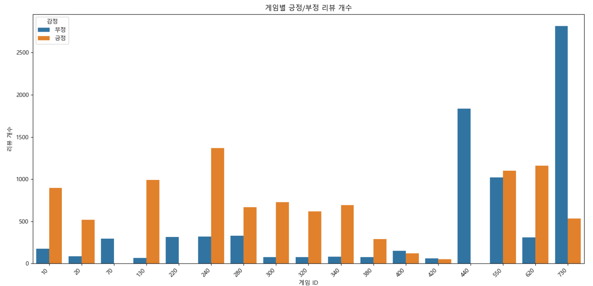
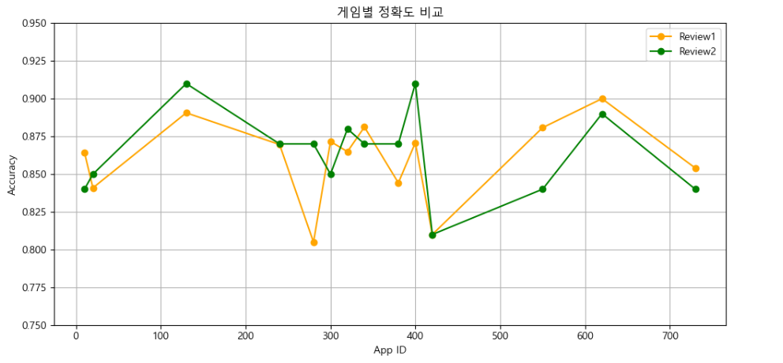
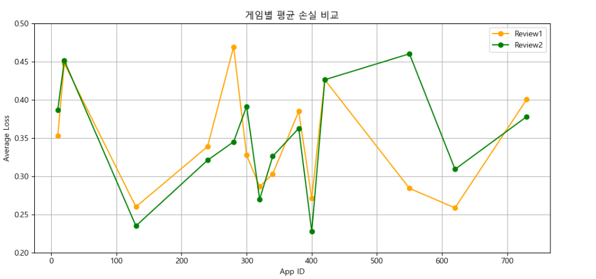

# Mobliebert를 홯용한 steam fps 게임 리뷰 분석

---
## 개요

게임 리뷰는 사용자가 경험과 만족도를 반영하는 중요한 데이터이다 긍정적인 리뷰는 게임 인지도와 매출증가에 도움을 주고
부정적인 리뷰는 게임 개선에 도움을 준다. 게임 리뷰 분석을 통하여 게임 사용자뿐 아니라 게임 개발자에게도 도움이 될 수
있는 긍정과 부정을 예측하는 프로젝트이다.

## 데이터
### 원시 데이터
리뷰 데이터는 총 168,931개이다.

| id | app_id | content | author_id | is_positive |
|----|--------|---------|-----------|-------------|
| 게임 리뷰의 고유 아이디 | 게임의 고유 아이디 | 리뷰 | 리뷰 작성자 고유 아이디 | 리뷰의 긍부정 (1=긍정, 0=부정) |

### 데이터 정제 과정

| 정제 항목       | 설명 |
|----------------|------|
| 언어 필터링     | 영어, 숫자, 공백만 포함하도록 변경 |
| 리뷰 길이       | 리뷰 글자 수가 5자 이상인 데이터만 필터링 |
| 게임 장르       | FPS 게임이 아닌 데이터 삭제 |
| 불필요 게임 삭제 | 긍정/부정 분석이 어려운, 리뷰 데이터가 하나뿐이거나 너무 적은 게임 삭제 |

### 게임 설명
| 게임 제목                        | 설명 |
|-------------------------------|------|
| Counter-Strike: Global Offensive | 테러/대테러 팀 기반의 대표적인 경쟁 FPS |
| Left 4 Dead 2                   | 4인 협동으로 좀비 무리를 돌파하는 생존 FPS |
| Counter-Strike: Source         | 원작 CS를 Source 엔진으로 리메이크한 버전 |
| Portal 2                        | 포탈 퍼즐과 유머러스한 스토리가 결합된 1인칭 퍼즐 게임 |
| Counter-Strike                 | 전략적 팀플레이 중심의 고전 전술 FPS |
| Half-Life: Blue Shift          | 블랙 메사 경비원의 시점에서 본 Half-Life 외전 |
| Half-Life: Source              | Half-Life를 Source 엔진으로 리마스터한 버전 |
| Day of Defeat: Source          | 제2차 세계대전 배경의 팀 기반 멀티 FPS |
| Half-Life 2: Lost Coast        | HDR 기술 시연용 Half-Life 2 보너스 챕터 |
| Half-Life 2: Deathmatch        | Half-Life 2 세계관의 멀티플레이 데스매치 모드 |
| Team Fortress Classic          | 다양한 클래스가 싸우는 초기 팀 기반 FPS |
| Half-Life 2: Episode One       | Half-Life 2 스토리 후속, Alyx와 탈출 여정 |
| Half-Life Deathmatch: Source   | Half-Life의 멀티 데스매치 리마스터 |
| Portal                         | 포탈 건을 이용한 독창적인 1인칭 퍼즐 게임 |
| Half-Life 2: Episode Two       | 시리즈의 감정적 클라이맥스를 담은 후속편 |

## 학습데이터 
각 게임마다 리뷰 데이터의 개수 차이가 크기 때문에, 두 가지 학습 데이터를 준비하여 어떤 데이터가 더 효과적으로 작용하는지 알아보았다. 
첫 번째 데이터는 각 게임마다 긍정/부정 데이터 중 더 적은 쪽의 개수에 맞춰 균형을 맞추어, 게임마다 사용할 수 있는 데이터를 
최대한 활용할 수 있도록 구성하였다. 두 번째 데이터는 모든 게임의 긍정/부정 리뷰 수를 각각 50개로 고정하여 사용하였다.

| 게임 제목                        | 첫 번째 - 긍정 | 첫 번째 - 부정 | 두 번째 - 긍정 | 두 번째 - 부정 |
|-------------------------------|----------------|----------------|----------------|----------------|
| Counter-Strike: Global Offensive | 531            | 531            | 50             | 50             |
| Left 4 Dead 2                   | 1019           | 1019           | 50             | 50             |
| Counter-Strike: Source         | 322            | 322            | 50             | 50             |
| Portal 2                        | 310            | 310            | 50             | 50             |
| Counter-Strike                 | 177            | 177            | 50             | 50             |
| Half-Life: Blue Shift          | 64             | 64             | 50             | 50             |
| Half-Life: Source              | 328            | 328            | 50             | 50             |
| Day of Defeat: Source          | 74             | 74             | 50             | 50             |
| Half-Life 2: Lost Coast        | 80             | 80             | 50             | 50             |
| Half-Life 2: Deathmatch        | 74             | 74             | 50             | 50             |
| Team Fortress Classic          | 88             | 88             | 50             | 50             |
| Half-Life 2: Episode One       | 77             | 77             | 50             | 50             |
| Half-Life Deathmatch: Source   | 48             | 48             | 50             | 50             |
| Portal                         | 120            | 120            | 50             | 50             |
| Half-Life 2: Episode Two       | 50             | 50             | 50             | 50             |

## 학습결과
| 게임 제목                      | Review1 정확도 | Review2 정확도 | Review1 평균 손실 | Review2 평균 손실 |
|-----------------------------|----------------|----------------|-------------------|-------------------|
| Counter-Strike: Global Offensive | 0.8540         | 0.84           | 0.400658          | 0.378101          |
| Left 4 Dead 2               | 0.8808         | 0.84           | 0.284154          | 0.460408          |
| Counter-Strike: Source      | 0.8696         | 0.87           | 0.338991          | 0.321022          |
| Portal 2                   | 0.9000         | 0.89           | 0.258602          | 0.309162          |
| Counter-Strike              | 0.8644         | 0.84           | 0.352693          | 0.386894          |
| Half-Life: Blue Shift       | 0.8906         | 0.91           | 0.259953          | 0.234932          |
| Half-Life: Source           | 0.8049         | 0.87           | 0.469414          | 0.345130          |
| Day of Defeat: Source       | 0.8716         | 0.85           | 0.327627          | 0.391586          |
| Half-Life 2: Lost Coast     | 0.8812         | 0.87           | 0.302978          | 0.326104          |
| Half-Life 2: Deathmatch     | 0.8649         | 0.88           | 0.286350          | 0.269870          |
| Team Fortress Classic       | 0.8409         | 0.85           | 0.447958          | 0.451677          |
| Half-Life 2: Episode One    | 0.8442         | 0.87           | 0.385033          | 0.362782          |
| Portal                     | 0.8708         | 0.91           | 0.271367          | 0.227888          |
| Half-Life 2: Episode Two    | 0.8100         | 0.81           | 0.426477          | 0.426477          |

# 학습결과
첫번째 데이터는 평균 정확도 0.8605, 두번째 데이터 평균 정확도 0.8636로 근소한 차이로 두번째 데이터가 높았으며,
평균 손실은 첫번째는 0.3433, 두번째는 0.3451로 평균 손실도 두번째 데이터가 높다 모두 같은 개수로 맞춘 데이터가 
정확도 향상은 우선시할 때는 더 효과적이지만 손실 감소를 위해 더 데이터를 다듬을 필요가 있는 것 같다.
